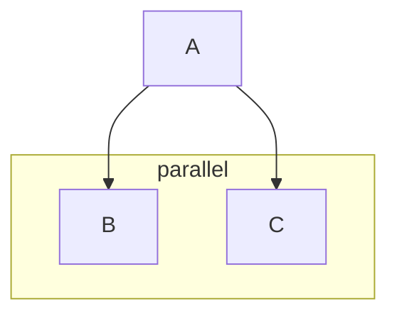

> Wireit upgrades your npm scripts to make them smarter and more efficient.

[](https://www.npmjs.com/package/wireit)
[](https://github.com/google/wireit/actions/workflows/tests.yml)

## Features

- 🙂 Use the `npm run` commands you already know
- ⛓️ Automatically run dependencies between npm scripts in parallel
- 👀 Watch any script and continuously re-run on changes
- 🥬 Skip scripts that are already fresh
- ♻️ Cache output locally and remotely on GitHub Actions for free
- 🛠️ Works with single packages, npm workspaces, and other monorepos

## Alpha

> ### 🚧 Wireit is alpha software — in active but early development. You are welcome to try it out, but note there a number of [missing features and issues](https://github.com/google/wireit/issues) that you may run into! 🚧

## Contents

- [Features](#features)
- [Install](#install)
- [Setup](#setup)
- [VSCode Extension](#vscode-extension)
- [Dependencies](#dependencies)
  - [Vanilla scripts](#vanilla-scripts)
  - [Cross-package dependencies](#cross-package-dependencies)
- [Parallelism](#parallelism)
- [Input and output files](#input-and-output-files)
- [Incremental build](#incremental-build)
- [Caching](#caching)
  - [Local caching](#local-caching)
  - [GitHub Actions caching](#github-actions-caching)
- [Cleaning output](#cleaning-output)
- [Watch mode](#watch-mode)
- [Package locks](#package-locks)
- [Recipes](#recipes)
  - [TypeScript](#typescript)
  - [ESLint](#eslint)
- [Reference](#reference)
  - [Configuration](#configuration)
  - [Dependency syntax](#dependency-syntax)
  - [Environment variables](#environment-variables)
  - [Glob patterns](#glob-patterns)
  - [Cache key](#cache-key)
- [Requirements](#requirements)
- [Related tools](#related-tools)
- [Contributing](#contributing)

## Install

```sh
npm i -D wireit
```

## Setup

Wireit works _with_ `npm run`, it doesn't replace it. To configure an NPM script
for Wireit, move the command into a new `wireit` section of your `package.json`,
and replace the original script with the `wireit` command.

<table>
<tr>
<th>Before</th>
<th>After</th>
</tr>
<tr>
<td>
<pre lang="json">
{
  "scripts": {
    "build": "tsc"
  }
}
</pre>
</td>
<td>
<pre lang="json">
{
  "scripts": {
    "build": "wireit"
  },
  "wireit": {
    "build": {
      "command": "tsc"
    }
  }
}
</pre>
</td>
</tr>
</table>

Now when you run `npm run build`, Wireit upgrades the script to be smarter and
more efficient. Wireit works with [yarn](https://yarnpkg.com/) and
[pnpm](https://pnpm.io/), too.

You should also add `.wireit` to your `.gitignore` file. Wireit uses the
`.wireit` directory to store caches and other data for your scripts.

```sh
echo .wireit >> .gitignore
```

## VSCode Extension

If you use VSCode, consider installing the `google.wireit` extension. It adds documentation on hover, autocomplete, can diagnose a number of common mistakes, and even suggest a refactoring to convert an npm script to use wireit.

Install it [from the marketplace](https://marketplace.visualstudio.com/items?itemName=google.wireit) or on the command line like:

```
code --install-extension google.wireit
```

## Dependencies

To declare a dependency between two scripts, edit the
`wireit.<script>.dependencies` list:

```json
{
  "scripts": {
    "build": "wireit",
    "bundle": "wireit"
  },
  "wireit": {
    "build": {
      "command": "tsc"
    },
    "bundle": {
      "command": "rollup -c",
      "dependencies": ["build"]
    }
  }
}
```

Now when you run `npm run bundle`, the `build` script will automatically run
first.

### Vanilla scripts

The scripts you depend on don't need to be configured for Wireit, they can be
vanilla `npm` scripts. This lets you only use Wireit for some of your scripts,
or to upgrade incrementally. Scripts that haven't been configured for Wireit are
always safe to use as dependencies; they just won't be fully optimized.

### Cross-package dependencies

Dependencies can refer to scripts in other npm packages by using a relative path
with the syntax `<relative-path>:<script-name>`. All cross-package dependencies
should start with a `"."`. Cross-package dependencies work well for npm
workspaces, as well as in other kinds of monorepos.

```json
{
  "scripts": {
    "build": "wireit"
  },
  "wireit": {
    "build": {
      "command": "tsc",
      "dependencies": ["../other-package:build"]
    }
  }
}
```

## Parallelism

Wireit will run scripts in parallel whenever it is safe to do so according to
the dependency graph.

For example, in this diagram, the `B` and `C` scripts will run in parallel,
while the `A` script won't start until both `B` and `C` finish.



By default, Wireit will run up to 4 scripts in parallel for every CPU core
detected on your system. To change this default, set the `WIREIT_PARALLEL`
[environment variable](#environment-variables) to a positive integer, or
`infinity` to run without a limit. You may want to lower this number if you
experience resource starvation in large builds. For example, to run only one
script at a time:

```sh
export WIREIT_PARALLEL=1
npm run build
```

## Input and output files

The `files` and `output` properties of `wireit.<script>` tell Wireit what your
script's input and output files are, respectively. They should be arrays of
[glob patterns](#glob-patterns), where paths are interpreted relative to the
package directory. They can be set on some, all, or none of your scripts.

Setting these properties allow you to use more features of Wireit:

|                                             | Requires<br>`files` | Requires<br>`output` |
| ------------------------------------------: | :-----------------: | :------------------: |
|       [**Dependency graph**](#dependencies) |          -          |          -           |
| [**Incremental build**](#incremental-build) |         ☑️          |          -           |
|               [**Watch mode**](#watch-mode) |         ☑️          |          -           |
|         [**Clean build**](#cleaning-output) |          -          |          ☑️          |
|                     [**Caching**](#caching) |         ☑️          |          ☑️          |

#### Example configuration

```json
{
  "scripts": {
    "build": "wireit",
    "bundle": "wireit"
  },
  "wireit": {
    "build": {
      "command": "tsc",
      "files": ["src/**/*.ts", "tsconfig.json"],
      "output": ["lib/**"]
    },
    "bundle": {
      "command": "rollup -c",
      "dependencies": ["build"],
      "files": ["rollup.config.json"],
      "output": ["dist/bundle.js"]
    }
  }
}
```

## Incremental build

Wireit can automatically skip execution of a script if nothing has changed that
would cause it to produce different output since the last time it ran. This is
called _incremental build_. When a script is skipped, any `stdout` or `stderr`
that it produced in the previous run is replayed.

To enable incremental build, configure the input files for each script by
specifying [glob patterns](#glob-patterns) in the `wireit.<script>.files` list.

> ℹ️ If a script doesn't have a `files` list defined at all, then it will _always_
> run, because Wireit doesn't know which files to check for changes. To tell
> Wireit it is safe to skip execution of a script that definitely has no input
> files, set `files` to an empty array (`files: []`).

## Caching

If a script has previously succeeded with the same configuration and input
files, then Wireit can copy the output from a cache, instead of running the
command. This can significantly improve build and test time. When a script is
restored from cache, any `stdout` or `stderr` is replayed.

To enable caching for a script, ensure you have defined both the [`files` and
`output`](#input-and-output-files) arrays.

> ℹ️ If a script doesn't produce any output files, it can still be cached by
> setting `output` to an empty array (`"output": []`). Empty output is common for
> tests, and is useful because it allows you to skip running tests if they
> previously passed with the exact same inputs.

### Local caching

In _local_ mode, Wireit caches `output` files to the `.wireit` folder inside
each of your packages.

Local caching is enabled by default, unless the
[`CI=true`](https://docs.github.com/en/enterprise-cloud@latest/actions/learn-github-actions/environment-variables#default-environment-variables)
environment variable is detected. To force local caching, set
`WIREIT_CACHE=local`. To disable local caching, set `WIREIT_CACHE=none`.

> ⚠️ Wireit does not currently limit the size of local caches. To free up this
> space, use `rm -rf .wireit/*/cache`. Automatic cache size limits will be added
> in an upcoming release, tracked at
> [wireit#71](https://github.com/google/wireit/issues/71).

### GitHub Actions caching

In _[GitHub Actions](https://github.com/features/actions)_ mode, Wireit caches
`output` files to the [GitHub Actions
cache](https://docs.github.com/en/actions/using-workflows/caching-dependencies-to-speed-up-workflows)
service. This service is available whenever running in GitHub Actions, and is
free for all GitHub users.

> ℹ️ GitHub Actions cache entries are automatically deleted after 7 days, or if
> total usage exceeds 10 GB (the least recently used cache entry is deleted
> first). See the [GitHub Actions
> documentation](https://docs.github.com/en/actions/using-workflows/caching-dependencies-to-speed-up-workflows#usage-limits-and-eviction-policy)
> for more details.

To enable caching on GitHub Actions, add the following
[`uses`](https://docs.github.com/en/actions/using-workflows/workflow-syntax-for-github-actions#jobsjob_idstepsuses)
clause to your workflow. It can appear anywhere before the first `npm run` or
`npm test` command:

```yaml
- uses: google/wireit@setup-github-actions-caching/v1
```

#### Example workflow

```yaml
# File: .github/workflows/tests.yml

name: Tests
on: [push, pull_request]
jobs:
  tests:
    os: ubuntu-20.04
    steps:
      - uses: actions/checkout@v3
      - uses: actions/setup-node@v3
        with:
          node-version: 16
          cache: true

      # Set up GitHub Actions caching for Wireit.
      - uses: google/wireit@setup-github-actions-caching/v1

      # Install npm dependencies.
      - run: npm ci

      # Run tests. Wireit will automatically use
      # the GitHub Actions cache whenever possible.
      - run: npm test
```

## Cleaning output

Wireit can automatically delete output files from previous runs before executing
a script. This is helpful for ensuring that every build is clean and free from
outdated files created in previous runs from source files that have since been
removed.

Cleaning is enabled by default as long as the
[`output`](#input-and-output-files) array is defined. To change this behavior,
set the `wireit.<script>.clean` property to one of these values:

| Setting             | Description                                                                                                                                                                                                                                                                                     |
| ------------------- | ----------------------------------------------------------------------------------------------------------------------------------------------------------------------------------------------------------------------------------------------------------------------------------------------- |
| `true`              | Clean before every run (the default).                                                                                                                                                                                                                                                           |
| `"if-file-deleted"` | Clean only if an input file has been deleted since the last run.<br><br>Use this option for tools that have incremental build support, but do not clean up outdated output when a source file has been deleted, such as `tsc --build` (see [TypeScript](#typescript) for more on this example.) |
| `false`             | Do not clean.<br><br>Only use this option if you are certain that the script command itself already takes care of removing outdated files from previous runs.                                                                                                                                   |

## Watch mode

In _watch_ mode, Wireit monitors all `files` of a script, and all `files` of its
transitive dependencies, and when there is a change, it re-runs only the
affected scripts. To enable watch mode, ensure that the
[`files`](#input-and-output-files) array is defined, and add the `watch`
argument:

```sh
npm run <script> watch
```

The benefit of Wireit's watch mode over built-in watch modes are:

- Wireit watches the entire dependency graph, so a single watch command replaces
  many built-in ones.
- It prevents problems that can occur when running many separate watch commands
  simultaneously, such as build steps being triggered before all preceding steps
  have finished.

## Package locks

By default, Wireit automatically treats
[`package-lock.json`](https://docs.npmjs.com/cli/v8/configuring-npm/package-lock-json)
files in the package directory, plus all parent directories, as input files.
This is useful because installing or upgrading your dependencies can affect the
behavior of your scripts, so it's important to re-run them whenever your
dependencies change.

If you are using an alternative package manager instead of npm, then your
package lock files might be named something else. Some examples are:

- Yarn: [`yarn.lock`](https://yarnpkg.com/configuration/yarnrc#lockfileFilename) (configurable)
- pnpm: [`pnpm-lock.yaml`](https://pnpm.io/git#lockfiles)

To change the name of the package lock files Wireit should look for, specify it
in the `wireit.<script>.packageLocks` array. Wireit will look for the given
filenames in the script's directory, as well as in all of its parent
directories. You can specify multiple filenames here, if needed.

```json
{
  "scripts": {
    "build": "wireit"
  },
  "wireit": {
    "build": {
      "command": "tsc",
      "files": ["src/**/*.ts", "tsconfig.json"],
      "output": ["lib/**"],
      "packageLocks": ["yarn.lock"]
    }
  }
}
```

If you're sure that a script isn't affected by dependencies at all, you can turn
off this behavior entirely to improve your cache hit rate by setting
`wireit.<script>.packageLocks` to `[]`.

## Recipes

This section contains advice about integrating specific build tools with Wireit.

### TypeScript

```json
{
  "scripts": {
    "ts": "wireit"
  },
  "wireit": {
    "ts": {
      "command": "tsc --build --pretty",
      "clean": "if-file-deleted",
      "files": ["src/**/*.ts", "tsconfig.json"],
      "output": ["lib/**", ".tsbuildinfo"]
    }
  }
}
```

- Set [`"incremental": true`](https://www.typescriptlang.org/tsconfig#incremental) and use
  [`--build`](https://www.typescriptlang.org/docs/handbook/project-references.html#build-mode-for-typescript)
  to enable incremental compilation, which significantly improves performance.
- Include
  [`.tsbuildinfo`](https://www.typescriptlang.org/tsconfig#tsBuildInfoFile) in
  `output` so that it is reset on clean builds. Otherwise `tsc` will get out of
  sync and produce incorrect output.
- Set [`"clean": "if-file-deleted"`](#cleaning-output) so that you get fast
  incremental compilation when sources are changed/added, but also stale outputs
  are cleaned up when a source is deleted (`tsc` does not clean up stale outputs
  by itself).
- Include `tsconfig.json` in `files` so that changing your configuration re-runs
  `tsc`.
- Use [`--pretty`](https://www.typescriptlang.org/tsconfig#pretty) to get
  colorful output despite not being attached to a TTY.

### ESLint

```json
{
  "scripts": {
    "lint": "wireit"
  },
  "wireit": {
    "lint": {
      "command": "eslint --color --cache --cache-location .eslintcache .",
      "files": ["src/**/*.ts", ".eslintignore", ".eslintrc.cjs"],
      "output": []
    }
  }
}
```

- Use
  [`--cache`](https://eslint.org/docs/user-guide/command-line-interface#caching)
  so that `eslint` only lints the files that were added or changed since the
  last run, which significantly improves performance.
- Use
  [`--color`](https://eslint.org/docs/user-guide/command-line-interface#--color---no-color)
  to get colorful output despite not being attached to a TTY.
- Include config and ignore files in `files` so that changing your configuration
  re-runs `eslint`.

## Reference

### Configuration

The following properties can be set inside `wireit.<script>` objects in
`package.json` files:

| Property       | Type                           | Default                 | Description                                                                                                 |
| -------------- | ------------------------------ | ----------------------- | ----------------------------------------------------------------------------------------------------------- |
| `command`      | `string`                       | `undefined`             | The shell command to run.                                                                                   |
| `dependencies` | `string[]`                     | `undefined`             | [Scripts that must run before this one](#dependencies).                                                     |
| `files`        | `string[]`                     | `undefined`             | Input file [glob patterns](#glob-patterns), used to determine the [cache key](#cache-key).                  |
| `output`       | `string[]`                     | `undefined`             | Output file [glob patterns](#glob-patterns), used for [caching](#caching) and [cleaning](#cleaning-output). |
| `clean`        | `boolean \| "if-file-deleted"` | `true`                  | [Delete output files before running](#cleaning-output).                                                     |
| `packageLocks` | `string[]`                     | `['package-lock.json']` | [Names of package lock files](#package-locks).                                                              |

### Dependency syntax

The following syntaxes can be used in the `wireit.<script>.dependencies` array:

| Example      | Description                                                                                     |
| ------------ | ----------------------------------------------------------------------------------------------- |
| `foo`        | Script named `"foo"` in the same package.                                                       |
| `../foo:bar` | Script named `"bar"` in the package found at `../foo` ([details](#cross-package-dependencies)). |

### Environment variables

The following environment variables affect the behavior of Wireit:

| Variable          | Description                                                                                                                                                                                                                                                                                                                                                                                                                          |
| ----------------- | ------------------------------------------------------------------------------------------------------------------------------------------------------------------------------------------------------------------------------------------------------------------------------------------------------------------------------------------------------------------------------------------------------------------------------------ |
| `WIREIT_PARALLEL` | [Maximum number of scripts to run at one time](#parallelism).<br><br>Defaults to 4×CPUs.<br><br>Must be a positive integer or `infinity`.                                                                                                                                                                                                                                                                                            |
| `WIREIT_CACHE`    | [Caching mode](#caching).<br><br>Defaults to `local` unless `CI` is `true`, in which case defaults to `none`.<br><br>Automatically set to `github` by the [`google/wireit@setup-github-actions-caching/v1`](#github-actions-caching) action.<br><br>Options:<ul><li>[`local`](#local-caching): Cache to local disk.</li><li>[`github`](#github-actions-caching): Cache to GitHub Actions.</li><li>`none`: Disable caching.</li></ul> |
| `CI`              | Affects the default value of `WIREIT_CACHE`.<br><br>Automatically set to `true` by [GitHub Actions](https://docs.github.com/en/actions/learn-github-actions/environment-variables#default-environment-variables) and most other CI (continuous integration) services.<br><br>Must be exactly `true`. If unset or any other value, interpreted as `false`.                                                                            |

### Glob patterns

The following glob syntaxes are supported in the `files` and `output` arrays:

| Example         | Description                                                                              |
| --------------- | ---------------------------------------------------------------------------------------- |
| `foo`           | The file named `foo`, or if `foo` is a directory, all recursive children of `foo`.       |
| `foo/*.js`      | All files directly in the `foo/` directory which end in `.js`.                           |
| `foo/**/*.js`   | All files in the `foo/` directory, and all recursive subdirectories, which end in `.js`. |
| `foo.{html,js}` | Files named `foo.html` or `foo.js`.                                                      |
| `!foo`          | Exclude the file or directory `foo` from previous matches.                               |

Also note these details:

- Whenever a directory is matched, all recursive children of that directory are
  included.
- Symlinks in input `files` are followed, so that they are identified by their content.
- Symlinks in `output` files are cached as symlinks, so that restoring from cache doesn't create unnecessary copies.
- The order of `!exclude` patterns is significant.
- Hidden/dot files are matched by `*` and `**`.
- Patterns are case-sensitive (if supported by the filesystem).

### Cache key

The following inputs determine the _cache key_ for a script. This key is used to
determine whether a script can be skipped for [incremental
build](#incremental-build), and whether its output can be [restored from
cache](#caching).

- The `command` setting.
- The `clean` setting.
- The `output` glob patterns.
- The SHA256 content hashes of all files matching `files`.
- The SHA256 content hashes of all files matching `packageLocks` in the current
  package and all parent directories.
- The system platform (e.g. `linux`, `win32`).
- The system CPU architecture (e.g. `x64`).
- The system Node version (e.g. `16.7.0`).
- The cache key of all transitive dependencies.

When using [GitHub Actions caching](#github-actions-caching), the following
input also affects the cache key:

- The `ImageOS` environment variable (e.g. `ubuntu20`, `macos11`).

## Requirements

Wireit is supported on Linux, macOS, and Windows.

Wireit is supported on Node Current (18), Active LTS (16), and the most recent
Maintenance LTS (14). See [Node releases](https://nodejs.org/en/about/releases/)
for the schedule.

## Related tools

Wireit shares a number of features with these other great tools, and we highly
recommend you check them out too:

- [Nx](https://nx.dev/)
- [Turborepo](https://turborepo.org/)
- [Chomp](https://chompbuild.com/)
- [Bazel](https://bazel.build/)

Here are some things you might especially like about Wireit:

- **Feels like npm**. When you use Wireit, you'll continue typing the same npm
  commands you already use, like `npm run build` and `npm test`. There are no
  new command-line tools to learn, and there's only one way to run each script.
  Your script config stays in your `package.json`, too. Wireit is designed to be
  the minimal addition to npm needed to get script dependencies and incremental
  build.

- **Caching with GitHub Actions**. Wireit supports caching build artifacts and
  test results directly through GitHub Actions, without any extra third-party
  services. Just add a single `uses:` line to your workflows.

- **Watch any script**. Want to automatically re-run your build and tests
  whenever you make a change? Type `npm test watch`. Any script you've
  configured using Wireit can be watched by typing `watch` after it.

- **Great for single packages and monorepos**. Wireit has no opinion about how
  your packages are arranged. It works great with single packages, because you
  can link together scripts within the same package. It also works great with
  any kind of monorepo, because you can link together scripts across different
  packages using relative paths.

- **Complements npm workspaces**. We think Wireit could be the missing tool that
  unlocks the potential for [npm
  workspaces](https://docs.npmjs.com/cli/v8/using-npm/workspaces) to become the
  best way to set up monorepos. To use Wireit with npm workspaces, you'll just
  use standard npm workspace commands like `npm run build -ws`.

- **Adopt incrementally**. Wireit scripts can depend on plain npm scripts, so
  they can be freely mixed. This means you can use Wireit only for the parts of
  your build that need it most, or you can try it out on a script-by-script
  basis without changing too much at the same time.

## Contributing

See [CONTRIBUTING.md](./CONTRIBUTING.md)
